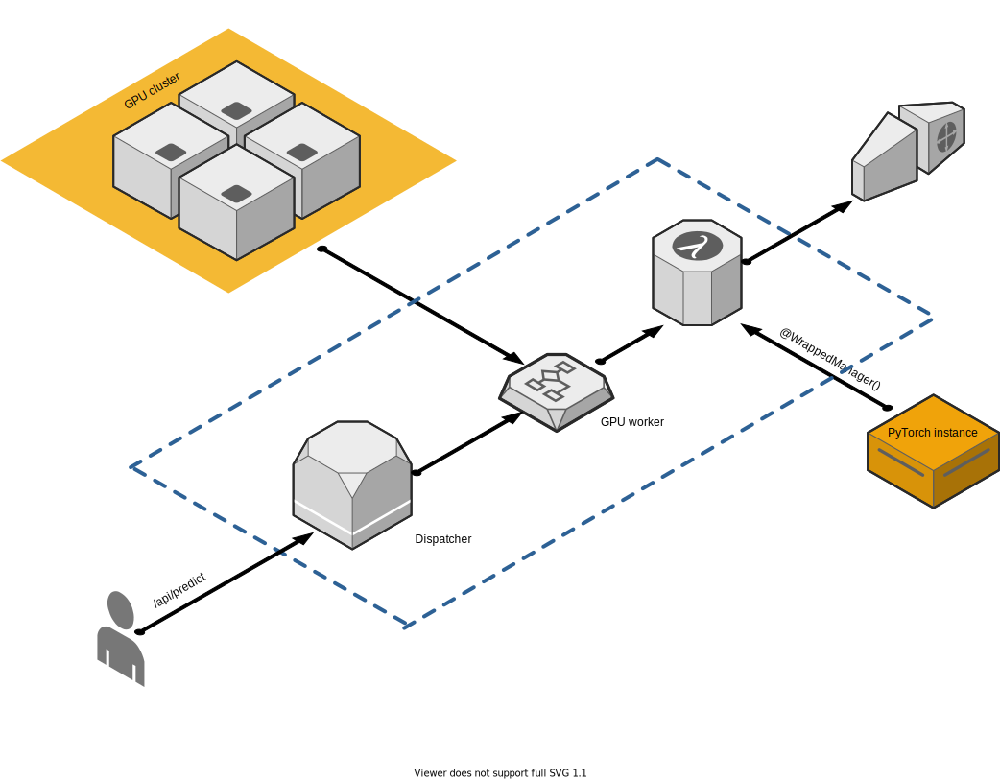

# distrbuted-deployment-ml
_a demo for enabling GPU inference for model serving_

## Background

_assumption: end user should train their model with CUDA-enabled in order to serve with GPU. Please refers to [PyTorch's tutorial on training on GPU](https://pytorch.org/tutorials/beginner/blitz/cifar10_tutorial.html#training-on-gpu) or [Tensorflow's guide on distributed training](https://www.tensorflow.org/guide/distributed_training)_

- refers to [rentainhe's tutorial](https://github.com/rentainhe/pytorch-distributed-training) on distributed training for PyTorch with `apex`

> Why do we want to enable GPU for inference?

-  deals with a smaller batch of inputs, which is different from training --> focus on minimizing e2e response time.
- [This blog post](https://developer.nvidia.com/blog/inference-next-step-gpu-accelerated-deep-learning/) talks more in dept of how deep neural network can utilize performance of GPUs vs. CPUs
- [This blog post](http://matthewrocklin.com/blog/work/2016/09/13/dask-and-celery) compares Python distributed task processing system, `dask.distributed` and `celery`

## Proposal



Dispatcher acts as a middleware to dynamically allocating # of GPUs for certain model. This will help users to statically allocate sets of GPUs for a model

- Queue requests can be sampled into mini-batches and forward to our GPU workers.
- we use `spawn` subprocess to run GPU workers. Dispatcher has setup two internal queues to handle request and response

```python
    self._input_queue = self.mp.Queue()
    self._output_queue = self.mp.Queue()
```

- prediction is then served via coressponding http response:

```shell

    nvidia-smi # supposed behavior
    
    +-----------------------------------------------------------------------------+
    | NVIDIA-SMI 465.24.02    Driver Version: 465.24.02    CUDA Version: 11.3     |
    |-------------------------------+----------------------+----------------------+
    | GPU  Name        Persistence-M| Bus-Id        Disp.A | Volatile Uncorr. ECC |
    | Fan  Temp  Perf  Pwr:Usage/Cap|         Memory-Usage | GPU-Util  Compute M. |
    |                               |                      |               MIG M. |
    |===============================+======================+======================|
    |   0  NVIDIA GeForce ...  Off  | 00000000:01:00.0  On |                  N/A |
    | N/A   88C    P0    42W /  N/A |    994MiB /  6078MiB |      6%      Default |
    |                               |                      |                  N/A |
    +-------------------------------+----------------------+----------------------+
                                                                                   
    +-----------------------------------------------------------------------------+
    | Processes:                                                                  |
    |  GPU   GI   CI        PID   Type   Process name                  GPU Memory |
    |        ID   ID                                                   Usage      |
    |=============================================================================|
    |    0   N/A  N/A       985      G   /home/aarnphm/venv/bin/python    1850MiB |
    |    0   N/A  N/A       986      G   /home/aarnphm/venv/bin/python    1850MiB |
    +-----------------------------------------------------------------------------+


```

- currently there is a bug with our `predict()` wrapper when handling model inference.

## Usecases:

```python
    # model.py
    class ManagedBertModel(Manager):
        def __init__(self, model=BertForSentimentClassification):
            super(ManagedBertModel, self).__init__(model)
            self.tokenizer = AutoTokenizer.from_pretrained(model_name_or_path)

        def predict(self, batch) -> List:
            batch_outputs = []
            for text in batch:
                with torch.no_grad():
                    tokens = self.tokenizer.tokenize(text)
                    tokens = ['[CLS]'] + tokens + ['[SEP]']
                    tokens_ids = self.tokenizer.convert_tokens_to_ids(tokens)
                    seq = torch.tensor(tokens_ids)
                    seq = seq.unsqueeze(0)
                    attn_mask = (seq != 0).long()
                    logit = self.model(seq, attn_mask)
                    prob = torch.sigmoid(logit.unsqueeze(-1))
                    prob = prob.item()
                    batch_outputs.append(prob)
            return batch_outputs

    # server.py
    from dispatcher import Dispatcher
    from model import ManagedBertModel
    
    @dispatcher(ManagedBertModel, BERT, batch_size=64, worker_num=2, cuda_devices=(0,))
    @app.route('/api/distributed', methods=['POST'])
    def distributed():
        inputs = flask.request.form.getlist('text')
        return jsonify(dispatcher.predict(inputs)), 200

    if __name__ == '__main__':
        WSGIServer(("0.0.0.0", 5000), app).serve_forever()
```

